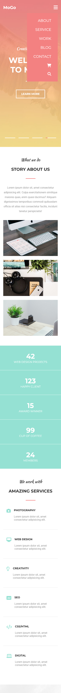
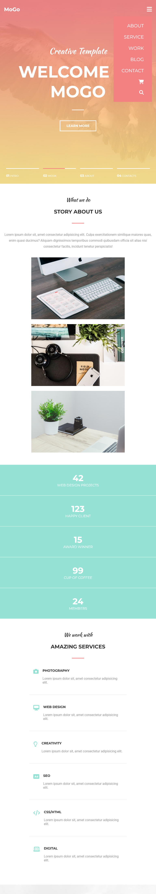
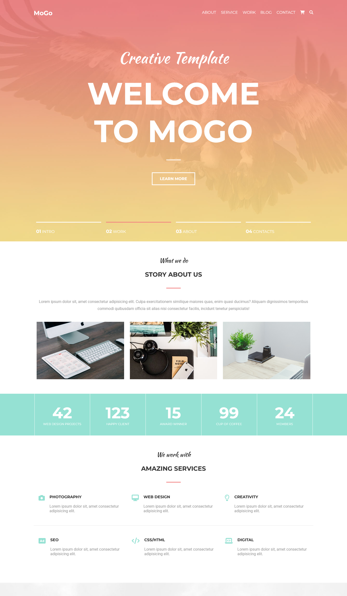

# MoGo Web Design Project

[](https://developer.mozilla.org/pt-BR/docs/Web/HTML) [](https://developer.mozilla.org/pt-BR/docs/Web/CSS) [](https://developer.mozilla.org/pt-BR/docs/Web/JavaScript) [](https://jquery.com/) [](https://sass-lang.com/)

Disponível em | *Avaliable in* :brazil: :us:

---

:brazil: Este projeto consiste numa página de um site fictício chamado Mogo, cujos serviços estão voltados para web design, design gráfico e, provavelmente, marketing digital. Foi construído para fins acadêmicos, com o intuito de se aplicar as tecnologias e padrões do web design. O layout foi desenhado por [Laaqiq](https://www.instagram.com/laaqiq.design/).

:us: *This project consists of a page from a fictitious website called Mogo, whose services are focused on web design, graphic design and, probably, digital marketing. It was built for academic purposes, in order to apply web design technologies and standards. The layout was designed by [Laaqiq](https://www.instagram.com/laaqiq.design/).*

## Status do projeto | Project status

:brazil: Projeto finalizado, sendo aberto a propostas de melhorias ou correções.

:us: *Finalized project, being open to proposals for improvements or corrections.*

## Layout

:brazil: Construído a partir do método *mobile-first*, o projeto é responsivo, ou seja, é adaptável aos mais variados tamanhos e resoluções de telas, conforme demonstrado a seguir.

:us: *Built from the mobile-first method, the project is responsive, that is, it is adaptable to the most varied sizes and screen resolutions, as shown below.*



Captura de tela em 375px | *Screenshot in 375px*

---



Captura de tela em 768px | *Screenshot in 768px*

---



Captura de tela em 1440px | *Screenshot in 1440px*

---

:brazil: Você também pode conferir a página acessando este link: [https://mogo-nu.vercel.app/](https://mogo-nu.vercel.app/).

**Observação:** Por se tratar de um projeto para fins acadêmicos, os links contidos na página não funcionarão, exceto os dois últimos localizados no rodapé.

:us: *You can also check the page by accessing this link: [https://mogo-nu.vercel.app/](https://mogo-nu.vercel.app/).*

_**Note:** As this is a project for academic purposes, the links on the page will not work, except for the last two located at the footer._

## Tecnologias utilizadas | Technologies used

:brazil: Foram utilizadas as seguintes tecnologias para a construção desta página:

:us: *The following technologies were used to build this page:*

- [HTML 5](https://developer.mozilla.org/pt-BR/docs/Web/HTML)
- [CSS 3](https://developer.mozilla.org/pt-BR/docs/Web/CSS)
- [JavaScript](https://developer.mozilla.org/pt-BR/docs/Web/JavaScript) / [jQuery](https://jquery.com/)
- [Sass](https://sass-lang.com/)

:brazil: Vale lembrar que foram aplicados o uso de tags semânticas ao HTML, para tornar a página com acessibilidade facilitada e seguir as boas práticas do desenvolvimento web.

O uso do preprocessador CSS (nesse caso o Sass) torna mais produtiva a aplicação das folhas de estilo, o que possibilita a manutenibilidade posteriormente.

:us: *It is worth remembering that the use of semantic tags was applied to the HTML, to make the page easier to access and follow the good practices of web development.*

*Using the CSS preprocessor (in this case Sass) makes the application of stylesheets more productive, which enables later maintainability.*

## Como instalar | How to install

:brazil: Para baixar e instalar o projeto no seu computador, siga os seguintes passos:

- Instale o editor [VS Code](https://code.visualstudio.com/) (recomendo fortemente, mas se há outro editor do seu gosto, não tem problema) e abra o projeto nele.
- Se você está usando VS Code, instale a extensão "[Live Sass Compiler](https://marketplace.visualstudio.com/items?itemName=ritwickdey.live-sass)", ela que vai converter seu Sass em CSS. Após instalado:
    - Clique no ícone de engrenagem, depois em "Configurações de extensão" e depois em "settins.json";
    - Em ```settings.json``` acrescente os seguintes parâmetros:
    ```json
    "liveSassCompile.settings.formats":[ 
        {
            "format": "expanded",
            "extensionName": ".css",
            "savePath": "assets/styles/css"
        },
        {
            "format": "compressed",
            "extensionName": ".min.css",
            "savePath": "assets/styles/css"
        },
    ]
    ```
    - Depois, na parte inferior do editor, clique em "Watch Sass".
- Se você não está usando VS Code, você precisa instalar o NodeJS para usar o Sass.
    - Depois de instalar o NodeJS, abra o prompt de comando e navegue até o diretório do projeto.
    ```
    cd [caminho do projeto]
    ```
    - Instale o Sass com o ```npm```.
    ```
    npm install -g sass
    ```
    - Ative o compilador com o seguinte comando:
    ```
    sass assets/styles/scss/style.scss:assets/styles/css/style.css --watch
    ```
- Recomendo também instalar a extensão "[Live server](https://marketplace.visualstudio.com/items?itemName=ritwickdey.LiveServer)". Caso não queira, abra o arquivo ```index.html``` no navegador.
- Divirta-se!

:us: *To download and install the project on your computer, follow these steps:*

- *Install the [VS Code](https://code.visualstudio.com/) editor (I highly recommend it, but if there's another editor you like, no problem) and open the project in it.*
- *If you are using VS Code, install the "[Live Sass Compiler](https://marketplace.visualstudio.com/items?itemName=ritwickdey.live-sass)" extension, which will convert your Sass into CSS. After installed:*
    - *Click on the gear icon, then on "Extension settings" and then on "settins.json";*
    - *In ```settings.json``` add the following parameters:*
    ```json
    "liveSassCompile.settings.formats":[ 
        {
            "format": "expanded",
            "extensionName": ".css",
            "savePath": "assets/styles/css"
        },
        {
            "format": "compressed",
            "extensionName": ".min.css",
            "savePath": "assets/styles/css"
        },
    ]
    ```
    - *Then, at the bottom of the editor, click on "Watch Sass".*
- *If you are not using VS Code, you need to install NodeJS to use Sass.*
    - *After installing NodeJS, open the command prompt and navigate to your project directory.*
    ```
    cd [project path]
    ```
    - *Install Sass with ```npm```.*
    ```
    npm install -g sass
    ```
    - *Activate the compiler with the following command:*
    ```
    sass assets/styles/scss/style.scss:assets/styles/css/style.css --watch
    ```

- *I also recommend installing the "[Live server](https://marketplace.visualstudio.com/items?itemName=ritwickdey.LiveServer)" extension. If not, open the ```index.html``` file in your browser.*
- *Enjoy it!*

## Autor | Author

Feito com :heart: por este cara sonhador:

*Made with :heart: by this dreamy guy:*

|  **Giulliano Guimarães** |
| ---------------------------------------------------------------------------------------------------------------------------------- |
|     |